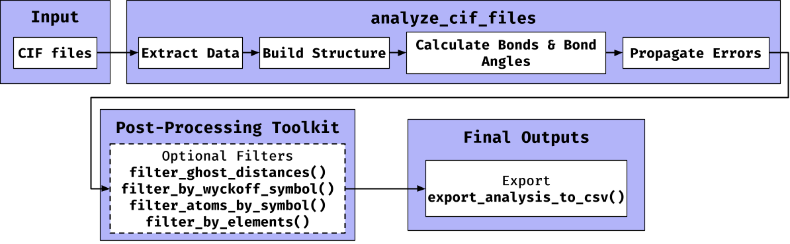
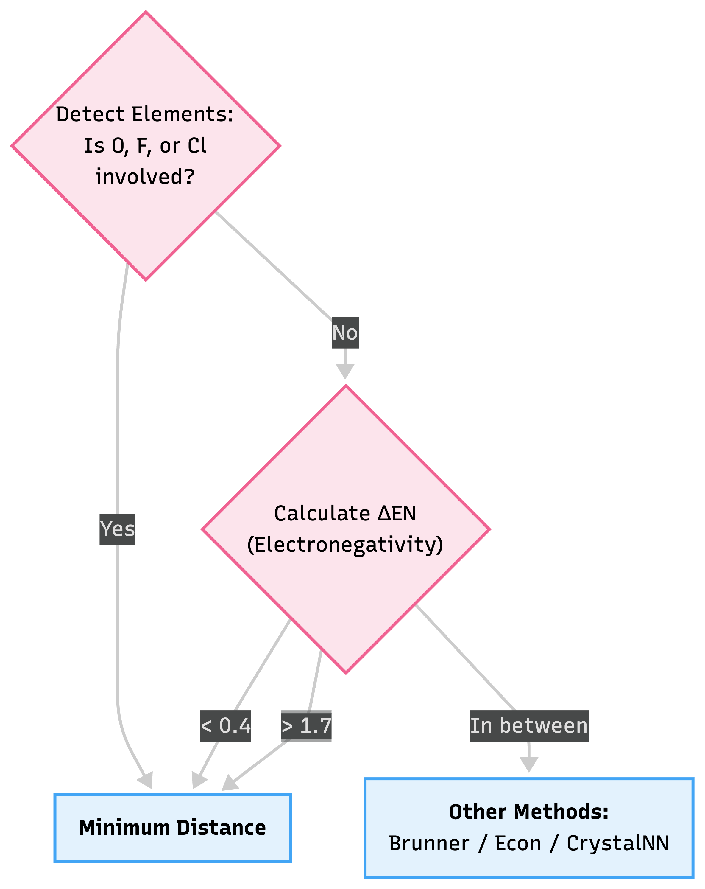
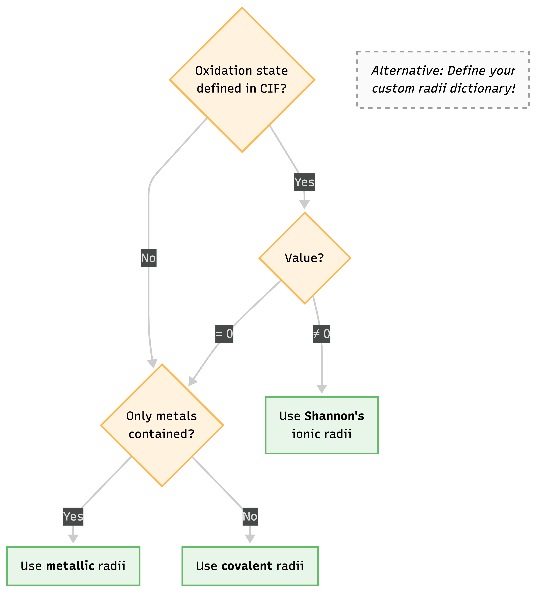

<!-- README.md is generated from README.Rmd. Please edit that file -->

```{r, include = FALSE}
knitr::opts_chunk$set(
  collapse = TRUE,
  comment = "#>",
  fig.path = "man/figures/README-",
  out.width = "100%"
)
```

# crystract

<!-- badges: start -->
<!-- After setting up, uncomment and update these badges -->
<!-- [](https://lifecycle.r-lib.org/articles/stages.html#experimental) -->
<!-- [](https://github.com/PrabhuLab/ml-crystals/actions/workflows/R-CMD-check.yaml) -->
<!-- badges: end -->

**crystract** provides a suite of functions to parse Crystallographic Information Files (`.cif`), extracting essential data such as chemical formulas, unit cell parameters, atomic coordinates, and symmetry operations. It also includes tools to calculate interatomic distances, identify bonded pairs using various algorithms (Minimum Distance, Brunner's, Hoppe's, Voronoi, CrystalNN), determine nearest neighbor counts, and calculate bond angles. All data is extracted into nested `data.table`s, which can then be exported as an R Data Structure (RDS) or folders of .csv files. The package is designed to facilitate the preparation of crystallographic data for further analysis, including machine learning applications in materials science.

> **Note on Repository Structure**
>
> The `crystract` package is located within the `packages/crystract/` subdirectory of the `PrabhuLab/ml-crystals` GitHub repository. You must use the `subdir` argument during installation, as shown below.

## Key Features

*   **Efficient CIF Parsing**: Utilizes `data.table` for fast and robust extraction of metadata, unit cell parameters, atomic coordinates, and symmetry operations.
*   **Symmetry and Supercell Generation**: Applies symmetry operations to generate a full unit cell from the asymmetric unit and expands coordinates into a 3x3x3 supercell for neighbor searching.
*   **Geometric Calculations**: Computes interatomic distances using the metric tensor (correct for all crystal systems) and calculates bond angles.
*   **Multiple Bonding Algorithms**: Implements several algorithms to identify bonded atoms, including the `minimum_distance` (default), `brunner`, `econ` (Hoppe's), `voronoi`, and `crystal_nn` methods.
*   **Rigorous Error Propagation**: Calculates and propagates experimental uncertainties from the CIF file into the final calculated bond lengths and angles.
*   **Powerful Post-Processing Tools**: Includes functions to filter results by chemical element, Wyckoff site, or to remove non-physical "ghost" distances caused by site disorder using a customizable atomic radii table.
*   **Batch Processing & Export**: The main `analyze_cif_files()` function is designed to process hundreds of files in a single run, and results can be easily exported to a structured directory of CSV files with `export_analysis_to_csv()`.

---

## Workflow Overview

The following diagram illustrates the primary data pipeline in `crystract`, from raw CIF input to final CSV export.

<div align="center">
  
</div>

---

## Best Practices & Decision Logic

To assist researchers in configuring `crystract` for their specific datasets, we provide the following decision trees for selecting atomic radii and choosing the most appropriate bonding algorithm.

### 1. Choosing a Bonding Algorithm

When invoking `analyze_cif_files(..., bonding_algorithms = c(...))`, we recommend choosing your target algorithm based on the chemical makeup of your structure and the electronegativity differences ($\Delta EN$) of the expected bonds.

<div align="center">
  
</div>

### 2. Atomic Radii Selection

When utilizing functions like `filter_ghost_distances()` or algorithms that rely on distance cutoffs, `crystract` employs an internal logic to select the most appropriate atomic radius. You can also override this by injecting your own custom radii dictionary via `set_radii_data()`.

<div align="center">
  
</div>

---

## Quickstart: A Complete Workflow & Real Outputs

The `analyze_single_cif()` (and its batch counterpart `analyze_cif_files()`) provides a complete, one-step workflow. Here we run it on an example crystal structure included inside the package itself, demonstrating the exact data outputs you can expect.

```{r workflow, message=FALSE, warning=FALSE}
library(crystract)
library(data.table)

# 1. Load the built-in demo CIF file (Strontium Silicide)
cif_path <- system.file("extdata", "1590946.cif", package = "crystract")

# 2. Analyze the file
# This single function handles parsing, supercell expansion, geometric calculations, 
# bonding detection, and error propagation.
analysis_results <- analyze_single_cif(
  cif_path,
  bonding_algorithms = c("minimum_distance", "crystal_nn")
)
```

### 1. Extracted Metadata
The returned object is a single row `data.table` containing both high-level metadata and list-columns storing the detailed extracted measurements.

```{r show-meta, echo=FALSE}
knitr::kable(
  analysis_results[, .(database_code, chemical_formula, space_group_name)], 
  caption = "High-Level Crystal Information"
)
```

### 2. Unit Cell Metrics
The parameters defining the size and shape of the unit cell are securely parsed along with their experimental uncertainties (if available in the CIF).

```{r show-cell, echo=FALSE}
knitr::kable(
  analysis_results$unit_cell_metrics[[1]][, 1:6], 
  caption = "Extracted Unit Cell Parameters (Å and Degrees)"
)
```

### 3. Detected Bonded Pairs
`crystract` identifies bonded pairs using your chosen algorithms. Below is the output from the **Minimum Distance** algorithm. Notice the rigorous propagation of experimental error (`DistanceError`). 

```{r show-bonds, echo=FALSE}
# Extract the list-column for Minimum Distance bonds
bonds <- analysis_results$bonds_minimum_distance[[1]]

knitr::kable(
  head(bonds[, .(Atom1, Atom2, Distance, DistanceError, Weight)]),
  caption = "Predicted Bonded Pairs (Minimum Distance Method)"
)
```

### 4. Calculated Bond Angles
Using the metric tensor, all connected triplets are evaluated to calculate the exact internal bond angles across the repeating periodic boundaries. 

```{r show-angles, echo=FALSE}
# Extract the list-column for Minimum Distance bond angles
angles <- analysis_results$angles_minimum_distance[[1]]

knitr::kable(
  head(angles[, .(CentralAtom, Neighbor1, Neighbor2, Angle, AngleError)]),
  caption = "Calculated Interatomic Angles"
)
```

---

### Data Dictionary

Here is a comprehensive overview of the columns generated in the Master Analysis Object and its nested tables.

#### 1. Master Analysis Object
| Column Name | Data Type | Description |
| :--- | :--- | :--- |
| `file_name` | Character | The name of the processed CIF file. |
| `database_code` | Character | The unique identifier from the source database. |
| `chemical_formula` | Character | The chemical sum formula extracted from the CIF. |
| `structure_type` | Character | The name of the structure type. |
| `space_group_name` | Character | Hermann-Mauguin space group symbol. |
| `space_group_number` | Character | International Tables space group number. |
| `unit_cell_metrics` | List (DT) | Nested table containing lattice parameters. |
| `atomic_coordinates` | List (DT) | Nested table of primary asymmetric atoms. |
| `symmetry_operations` | List (DT) | Nested table of symmetry operators. |
| `transformed_coords` | List (DT) | Nested table of the full unit cell atoms. |
| `expanded_coords` | List (DT) | Nested table of the supercell (3x3x3) atoms. |
| `distances` | List (DT) | Nested table of all calculated interatomic distances. |
| `bonded_pairs_*` | List (DT) | Nested table of bonds detected via requested methods (e.g. `_minimum_distance`). |
| `neighbor_counts_*`| List (DT) | Nested table of coordination numbers for requested methods. |
| `bond_angles_*` | List (DT) | Nested table of calculated bond angles for requested methods. |

#### 2. Atomic Coordinates (Nested)
| Column Name | Data Type | Description |
| :--- | :--- | :--- |
| `Label` | Character | Unique atom label (e.g., "Fe1"). |
| `WyckoffSymbol` | Character | The Wyckoff letter (e.g., "c"). |
| `WyckoffMultiplicity` | Numeric | The site multiplicity (e.g., 4). |
| `Occupancy` | Numeric | Site occupancy factor (0.0 to 1.0). |
| `x_a`, `y_b`, `z_c` | Numeric | Fractional coordinates along axis $a, b, c$. |
| `*_error` | Numeric | Standard uncertainties for coordinates. |

#### 3. Bonded Pairs (Nested)
| Column Name | Data Type | Description |
| :--- | :--- | :--- |
| `Atom1` | Character | Label of the central atom (from the asymmetric unit). |
| `Atom2` | Character | Label of the neighbor atom (from the expanded supercell). |
| `Distance` | Numeric | Calculated Euclidean distance in Angstroms (Å). |
| `DistanceError` | Numeric | Propagated standard uncertainty of the distance. |
| `DeltaX`, `DeltaY`, `DeltaZ` | Numeric | Difference in fractional coordinates ($x_1 - x_2$). |
| `Weight` | Numeric | Calculated bond weight/strength depending on the algorithm. |

## Licensing

`crystract` is offered under a dual-license model to accommodate a variety of use cases:

*   **For Open-Source Projects:** The package is licensed under the **GNU General Public License v3.0 (GPL-3.0)**. If you are developing other open-source software, you are free to use, modify, and distribute `crystract` under the terms of the GPL-3.0.

*   **For Commercial Use:** If you wish to use `crystract` in a commercial product, for commercial services, or for any other commercial purpose, you must obtain a separate commercial license. Please contact the package maintainer to arrange the terms.

## Installation

You can install `crystract` either from **CRAN (recommended for most users)** or directly from **GitHub (for the latest development version)**.

### Prerequisites

* Install the latest version of **R** from CRAN
* (Optional but recommended) Install **RStudio Desktop IDE**

### Option 1: Install from CRAN (Stable Version)

If `crystract` is available on CRAN, this is the simplest and most stable method:

```r
install.packages("crystract")
```

### Option 2: Install from GitHub (Latest Development Version)

To get the most recent updates and features:

```r
# Install remotes if not already installed
install.packages("remotes")

# Install crystract from GitHub
remotes::install_github(
  "PrabhuLab/ml-crystals",
  subdir = "packages/crystract",
  build_vignettes = TRUE
)
```

### Verifying the Installation

After installation, load the package:

```r
library(crystract)
```

If no errors appear, the installation was successful.

### Notes

* Use the **CRAN version** for stability and reproducibility.
* Use the **GitHub version** if you need the latest features or bug fixes that haven’t been released yet.

## Learning More

For a detailed, step-by-step guide explaining each function, the crystallographic principles, and the formulas used for calculations, please see the package vignette.

You can access it with the following command after you have successfully installed the package:

```{r, eval=FALSE}
# This command opens the detailed package guide
vignette("crystract")
```

## Community Guidelines

We welcome and appreciate all forms of community engagement. To ensure a smooth and productive collaboration, we have established guidelines for contributing, reporting issues, and seeking support.

All participants in this project are expected to abide by our **[Code of Conduct](https://prabhulab.github.io/ml-crystals/CODE_OF_CONDUCT.html)**. Please read it to understand the standards of behavior we expect.

For detailed instructions on how to contribute to the software, report bugs, or suggest new features, please review our **[Contributing Guidelines](https://prabhulab.github.io/ml-crystals/CONTRIBUTING.html)**.

## Authors

**Authors and Maintainers:** Don Ngo (`dngo@carnegiescience.edu`) & Anirudh Prabhu (`aprabhu@carnegiescience.edu`)
